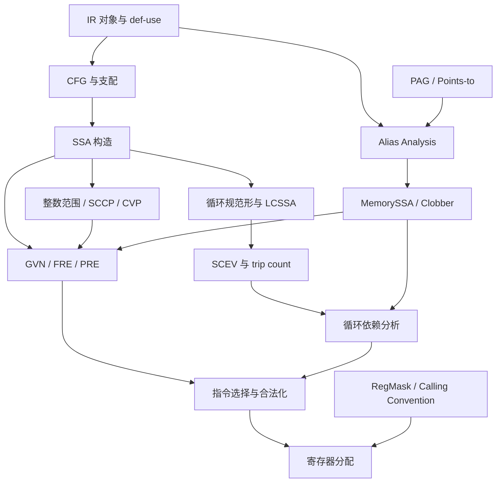

# Compiler Notes

这个目录记录可跨编译器和项目复用的中间表示（Intermediate Representation，IR）、程序分析和优化知识，重点是定义、机制、正确性前提、实现变体、例子和局限。

## 推荐阅读顺序

### 第一组：IR、CFG 与 SSA

1. [[IR 对象模型与安全改写]]：容器树、CFG、def-use graph、对象 identity 和结构化改写。
2. [[dom|支配、后支配与支配边界]]：dominator tree、dominance frontier、post-dominance 和 control dependence。
3. [[构造|SSA 构造与维护]]：Phi 放置、支配树重命名、critical edge、LCSSA 与 SSA destruction。

### 第二组：循环与内存

4. [[循环规范形与 LCSSA]]：preheader、latch、dedicated exit、rotation 和 zero-trip 语义。
5. [[SCEV]]：用 AddRec 表达 induction variable、trip count 和仿射地址。
6. [[Alias Analysis]]：区分 NoAlias、MayAlias、MustAlias、points-to 与精度维度。
7. [[内存优化证明：Alias Analysis 与 MemorySSA]]：从 memory object、alias、ModRef 推到 memory version 和 clobber。
8. [[循环依赖分析]]：flow/anti/output dependence、direction vector、distance 和迭代域。

### 第三组：标量优化与后端

9. [[整数范围分析]]：interval、known bits、branch refinement 和 fixed point。
10. [[GVN、FRE 与 PRE]]：表达式等价、availability、完全冗余和部分冗余。
11. [[指令选择与合法化]]：pattern matching、immediate/address folding、pseudo 和 legalization。
12. [[寄存器分配]]：liveness、live segment、interference、split、spill、rematerialization 和 parallel move。
13. [[RegMask]]：call clobber 与跨调用寄存器约束。

## 专题笔记

- [[IPSCCP]]：跨过程稀疏条件常量传播，同时维护 value lattice 与 executable edges。
- [[CVP]]：利用控制流上下文中的 predicate 和关系事实继续化简。
- [[Jump Threading]]：把特定 predecessor edge 直接连接到已确定的 successor，并维护边上的 SSA 语义。
- [[PAG]]：Pointer Assignment Graph、points-to constraints 与图上的可达性。

## 知识关系

## 关系速记

CFG 表示“控制可能走到哪里”，SSA 表示“某个值由哪个唯一定义产生，并流向哪些使用”。两者共同支撑稀疏分析：φ 节点在 CFG 合流处合并值，dominance 则约束定义和路径事实可以影响的区域。

[[PAG]] 表示指针值和抽象内存对象之间的赋值、取址、load/store、字段与跨过程传递约束；[[Alias Analysis|alias analysis]] 利用 points-to 集合、对象相对位置或合法图路径回答两个内存访问是否可能指向同一位置。PAG 是一种分析表示，不等同于 alias analysis，也不等同于 SSA def-use 图或 CFG。flow-sensitive、path-sensitive 的指针分析会额外利用 CFG 的程序点和路径信息；flow-insensitive PAG 则可能保留控制上互斥的传播组合。

`IPSCCP` 和 `CVP` 都传播事实来简化 IR，但关注点不同：

- `IPSCCP` 沿 SSA def-use 链和调用关系传播格值，同时维护 CFG 边的可执行性，主要回答“值能否成为常量”。
- `CVP` 利用支配当前点的条件和范围，主要回答“在这条路径上，后续判断能否化简”。
- alias/mod-ref 分析可以帮助判断 load/store 和调用的内存影响，从而间接暴露更多常量或路径化简机会；PAG 可以作为该分析的底层表示。这不意味着 CVP/IPSCCP 必然直接查询 PAG 或 alias analysis；它们的核心传播图不是 PAG，普通 PAG 可达性也不能当作常量或路径事实。

`Jump Threading` 消费 [[CVP]]、[[整数范围分析|范围分析]] 或 SCCP 产生的路径事实，把某条入边直接接到必然选择的后继，并负责转译 Phi incoming 和清理不可达控制流。新增边还要避免破坏单入口循环或制造 irreducible CFG。

`SCEV` 不直接等价于某个变换，而是循环优化的基础分析：它描述值随迭代如何变化、循环可能执行多少次以及下标是否呈规律增长。

`RegMask` 属于更靠后的机器码阶段。它不关心 IR 值是否为常量或两个指针是否 alias，而是描述机器指令对物理寄存器的保留和破坏，从而约束寄存器分配与物理寄存器活跃性。

[[GVN、FRE 与 PRE]] 与范围传播的区别是：前者先建立 expressions 的等价和 availability，后者先建立 value 的取值集合或关系事实。两者都可能化简同一条指令，但证明来源不同。

[[循环依赖分析]] 同时消费对象/alias、[[SCEV]] 仿射地址和迭代域信息，决定循环重排是否保持内存访问顺序。[[指令选择与合法化]] 再把高层 value operations 映射为目标机器形式，最终由 [[寄存器分配]] 处理物理资源冲突。
